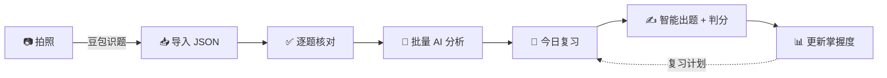

<div align="center">

# 错题本 · Mistake Notebook

**AI 驱动的学生错题管理与复习系统**

拍照交给豆包识题 → 导入 JSON → AI 错因归因 → 间隔复习 → 智能出题 → 掌握度闭环
A self-hosted AI-powered mistake notebook for middle & high school students (Chinese / Math / English).

[](./LICENSE)
[](https://nodejs.org/)

[](https://www.typescriptlang.org/)
[](https://react.dev/)
[](https://sqlite.org/)

<!-- TODO: 界面截图放入 docs/screenshots/ 并在此展示 -->

</div>

---

错题本不是「存错题图片的网盘」，而是一个完整的学习闭环工具：快速录入语文、数学、英语错题，由 AI 结合历史错题规律与学生画像完成**错误归因**与**薄弱知识点识别**，再通过**间隔复习**与**智能出题**持续更新**掌握度**。全部数据保存在本地 SQLite，免登录，单机家庭使用。

设计原则：录入必须快、AI 结果必须可修改、学习闭环优先于功能数量、模块化单体而不是微服务。

## ✨ 功能特性

- 📷 **豆包识题，一键导入** — 作业拍照交给豆包，按版本化模板输出 JSON；粘贴或上传文件导入，逐题核对（含豆包原文对照），导入不调用任何模型
- 🤖 **AI 主动归因** — 结合历史错题规律与学生画像，自动归因技术性原因（知识缺失 / 审题 / 方法选择 / 计算 / 表达规范）与学习方法问题（检查习惯 / 注意力 / 紧张 / 时间不足），输出三层建议；结论带证据与置信度，允许学生纠正
- 📖 **今日复习** — 按学科可配的复习节奏（如数学 1→10→30 天），答错不倒退档位；本地判定或 AI 判分，支持申诉与自判改判
- ✍️ **智能出题** — 可选学科、「出旧题 / 编新题」开关，LLM 先做选题分析；生成题经 Schema、答案唯一性、学科规则等多道校验
- 📊 **学习分析 Dashboard** — 薄弱知识点、错误类型分布、学习方法画像；纯查询，绝不触发模型调用
- 🔍 **FTS5 全文搜索** — 错题增删改查与全文检索
- 🧩 **图形题自动识别** — 依赖图形作答的题目（确定性关键词规则）只保留统计与归因，不参与练习与复习
- 📤 **数据自主** — 一键导出；永久清空需口令解锁（`APP_AUTH_TOKEN`），同步清理导入存档、派生统计与记忆证据
- 📲 **PWA** — 浏览器即用，可安装到手机桌面

## 🔄 学习闭环



批量分析由后台任务队列执行（每批最多 10 题，并发 1～2），每题结果幂等落库；部分失败时保留旧总结，下次只重试剩余项。掌握度与统计由确定性代码计算，可随时从事实源重建。

## 🛠️ 技术栈

| 层 | 技术 |
|---|---|
| 前端 | React 18 · TypeScript · Vite · Mantine · KaTeX · PWA |
| 后端 | Node.js · Fastify · Zod · Drizzle ORM |
| 数据 | SQLite（WAL + foreign keys + busy timeout），本地优先，不上传云端 |
| AI | DeepSeek / GLM / Kimi 单槽位（`text_model`），提示词外置于 [`llm_prompts/`](./llm_prompts/) |
| 后台任务 | SQLite `ai_jobs` 表 + 进程内任务循环；模型调用不持有数据库事务 |
| 测试 | Vitest · shared 22 + server 90，全部通过 |

## 🚀 快速开始

```bash
git clone https://github.com/xuyuandong/MistakeNotebook.git
cd MistakeNotebook
pnpm install
cp .env.example .env      # 填入 DEEPSEEK_API_KEY（或 KIMI_API_KEY）；留空则降级 mock provider，仅限开发
pnpm dev                  # 并行启动 server(:8787) 与 web(:5173)
```

打开 http://localhost:5173 即用（免登录，单机家庭使用；**不要暴露到公网**）。需要 Node.js ≥ 20 与 pnpm。

| 命令 | 说明 |
|---|---|
| `pnpm dev` | 并行启动前后端 dev server |
| `pnpm test` | 全部 Vitest 测试（迁移 / 配置 / 任务幂等 / Schema / 判分） |
| `pnpm typecheck` | 全仓 TypeScript 检查 |
| `pnpm build` | 构建 web 静态资源（含 PWA service worker） |

## 🔑 配置：`.env` 与模型

### `.env`（密钥与运行参数）

从 `.env.example` 复制后填写。服务端从自身目录向上查找：`server/.env` 或仓库根目录 `.env` 均可（先找到的生效）；进程里已存在的同名环境变量优先，`.env` 不会覆盖它们。`.env` 已被 gitignore，**密钥只放这里，不入库、不入日志**。

| 变量 | 说明 |
|---|---|
| `PORT` | 服务端口，默认 `8787` |
| `DATA_DIR` | SQLite 与附件的持久化根目录，默认 `./data` |
| `APP_AUTH_TOKEN` | 设置页「永久删除全部数据」的解锁口令；留空 = 清空功能锁定 |
| 模型密钥 | 变量名由 `config/models.yaml` 的 `api_key_env` 指定，`.env.example` 预置了 `DEEPSEEK_API_KEY` / `KIMI_API_KEY` |

### `config/models.yaml`（模型槽位）

系统只有一个 `text_model` 槽位，错误归因、总结、出题、判分共用；题目识别在豆包侧完成，本系统不接视觉模型。字段：

| 字段 | 说明 |
|---|---|
| `provider` | 只允许 `deepseek` / `glm` / `kimi` / `mock`（mock 仅用于开发测试） |
| `protocol` | `openai`（Chat Completions）或 `anthropic`（Messages 协议，如 Kimi 端点） |
| `base_url` | API 地址，支持 `${VAR}` 形式引用环境变量 |
| `api_key_env` | 存放密钥的环境变量**名称**（密钥本身不写入 yaml） |
| `model` | 模型名，以各家控制台为准 |

默认配置即 DeepSeek：

```yaml
text_model:
  provider: deepseek
  protocol: openai
  base_url: https://api.deepseek.com
  api_key_env: DEEPSEEK_API_KEY
  model: deepseek-v4-flash
```

切换到 Kimi 或 GLM 时改写槽位并在 `.env` 补对应密钥，例如：

```yaml
# Kimi（Anthropic 兼容端点）
text_model:
  provider: kimi
  protocol: anthropic
  base_url: https://api.moonshot.cn/anthropic
  api_key_env: KIMI_API_KEY
  model: kimi-k2-…   # 以月之暗面控制台为准

# GLM（OpenAI 兼容端点）
text_model:
  provider: glm
  protocol: openai
  base_url: https://open.bigmodel.cn/api/paas/v4
  api_key_env: ZHIPU_API_KEY   # 在 .env 中补 ZHIPU_API_KEY=…
  model: glm-4…                # 以智谱控制台为准
```

规则：修改 `models.yaml` 或 `.env` 后**重启服务生效**，不做热切换、自动路由或故障转移；`api_key_env` 指向的变量未设置时，开发环境降级为 mock provider 并打印警告（按任务类型返回最小可用的占位 JSON，仅供开发联调），生产环境（`NODE_ENV=production`）直接拒绝启动。

## 📂 仓库结构

```text
server/           # Fastify + TypeScript + Drizzle + SQLite(WAL) 模块化单体
web/              # React + Vite + Mantine + PWA
packages/shared/  # 前后端共用 Zod 契约（REST DTO + AI 输出/豆包导入 Schema）
config/           # models.yaml：text_model 槽位（识题已外移至豆包）
llm_prompts/      # 全部提示词唯一真源（含豆包识题模板，启动时加载）
evals/            # AI 黄金评测集
data/             # 运行时数据（gitignore）：app.db 与 AI 原始输出
```

## ❓ FAQ

**支持哪些学科和年级？**
语文、数学、英语，初中高中通用；当前年级只用于难度语境与历史权重，不会过滤其他历史资料。

**为什么题目识别要在豆包里完成？**
手机拍照识题交给豆包更准，本系统专注「导入 → 分析 → 复习」闭环：不接入视觉模型、不解析图片/PDF，复杂度与成本更低。豆包按版本化模板输出 JSON，导入时做确定性校验与归一。

**AI 会乱下结论吗？**
AI 归因必须结合历史错题规律与学生画像，输出带证据与置信度的假设，允许学生纠正；完全无依据时输出「未确认」。主观题判分输出判定与依据，学生可申诉或自判改判，改判入库且不重复计入掌握度。

**数据存在哪里？会不会上传？**
全部保存在本地 SQLite（`data/app.db`），不上传任何云端。AI 长期记忆带证据、置信度与版本，可从事实源重建；删除错题或清空数据时同步清理导入存档、派生统计与记忆证据。

**可以多人使用或部署公网吗？**
MVP 免登录，仅限单机 / 可信内网家庭使用。公网部署前必须先恢复鉴权与用户隔离。

## 🗺️ Roadmap

- [x] 豆包 JSON 导入 · AI 归因 · 复习调度 · 智能出题 · 判分申诉 · 学习 Dashboard · 导出/清空（PRD v0.4）
- [ ] `evals/` 黄金评测集填充与 AI 回归
- [ ] Playwright E2E
- [ ] 备份脚本 `scripts/backup.sh`

## 📚 文档

| 文档 | 内容 |
|---|---|
| [PRD](./docs/PRD.md) | 产品需求文档 |
| [HLD](./docs/HLD.md) | 高层架构设计 |
| [LLD](./docs/LLD.md) | DDL 级数据模型、API 契约、模块与任务流程（含豆包识题模板附录） |
| [AGENTS.md](./AGENTS.md) | 编码 Agent 工程纪律 |
| [MANUAL-TEST.md](./docs/MANUAL-TEST.md) | 人工验收清单 |
| [llm_prompts/](./llm_prompts/) | 全部提示词唯一真源（含豆包识题模板与 Skill 成品） |

## 📄 许可证

[MIT](./LICENSE) © 2026 xuyuandong
