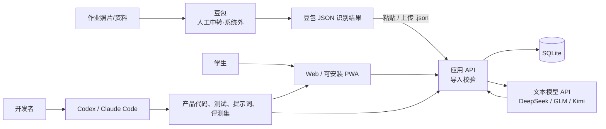
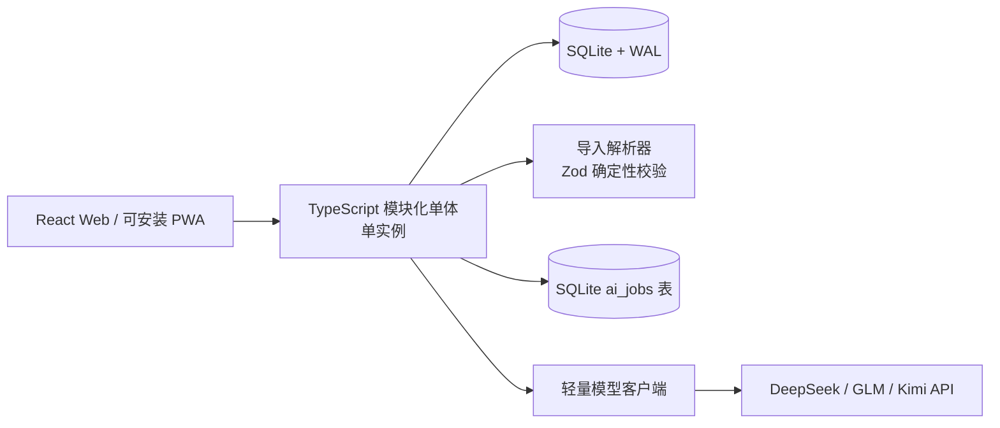
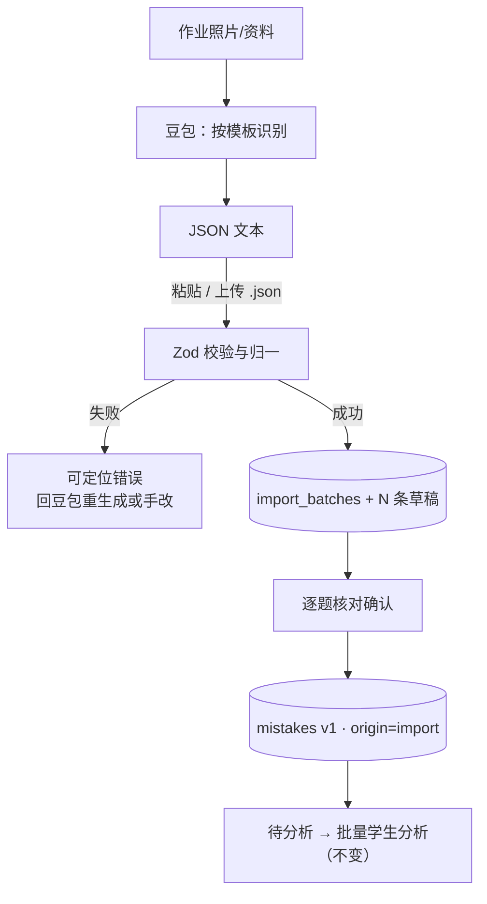
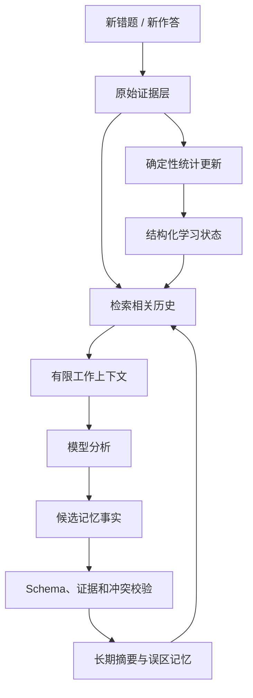
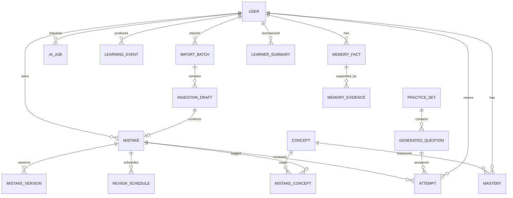

# 学生错题本 High-level Design

> 版本：v0.3  
> 日期：2026-08-29  
> 架构目标：Web/PWA 单端、SQLite 单实例、豆包外部识题 + 文本模型 API 承载分析出题、数据驱动知识发现  
> 变更记录：v0.3 识题方案改为“豆包人工中转 + JSON 导入”，移除 vision_model 槽位与图片/PDF 上传

## 1. 最终建议

采用“**独立应用 + 豆包外部识题 + 文本模型 API + AI 编程工具辅助开发**”。

- 学生通过 Web 使用，也可将 PWA 安装到桌面；MVP 不开发原生 macOS 客户端。
- 作业照片由人工交给豆包（App/网页版），豆包按版本化模板输出结构化 JSON；本系统只导入该 JSON，不接收图片/PDF 原件，不自建 OCR/VLM，也不调用视觉模型。
- 错误分析与画像、智能出题、作答判分是受约束的服务函数，不使用自主 Agent 循环。
- Codex/Claude Code 用于写代码、生成测试、维护提示词和运行评测。
- Skill 用于沉淀“开发这个产品的方法”，不作为产品数据库、UI 或主要运行环境。



## 2. 为什么产品不能只做成 Skill

Skill 很适合“有一个操作者，在对话里完成一项工作”，例如“读取一批样本并跑导入回归评测”。学生错题本还需要很多普通软件能力：

- 稳定、低门槛的学生界面；
- 数据可靠持久化、备份恢复与权限边界；
- 错题、导入原文、复习计划和作答历史的持久化；
- 导入原文与识别结果的并排编辑；
- 后台任务、失败重试、限额和成本控制；
- 未成年人隐私、数据导出和删除；
- 可重复的统计口径和掌握度算法。

若把产品本身做成 Codex/Claude Code Skill，会产生以下问题：

| 问题 | 后果 |
|---|---|
| 学生需进入开发者/Agent 工具 | 使用门槛高，不像普通学习软件 |
| UI 主要是对话与文件 | 逐题核对、错题编辑、复习作答体验受限 |
| 状态散落在会话、文件或外部工具 | 多用户隔离、同步和数据迁移困难 |
| Agent 行为具有自主性 | 结果稳定性、权限和费用更难控制 |
| 绑定特定平台的 Skill 机制 | 平台迁移和供应商切换困难 |
| 难以做产品指标和精确回放 | 无法可靠解释掌握度与每次 AI 修改 |

结论：如果只给自己做一个两三天的概念验证，Skill 足够；如果要真正给学生长期使用，独立应用更合适。

## 3. Codex/Claude Code 的正确位置

### 3.1 日常开发工具

可以直接用它们完成：

- 搭建 React/PWA/API/数据库代码；
- 根据 PRD 实现页面和接口；
- 编写数据库迁移、测试和 CI；
- 根据失败样本修复提示词和校验规则；
- 做依赖升级、安全审查和发布检查；
- 生成三科测试样本的初稿，再由人审核。

### 3.2 项目专用开发 Skill

当流程稳定后，可建立一个仅供开发者使用的 Skill，例如 `mistake-book-maintainer`，包含：

```text
mistake-book-maintainer/
├── SKILL.md
├── references/
│   ├── product-rules.md
│   ├── ai-contracts.md
│   ├── concept-rules.md
│   └── release-checklist.md
└── scripts/
    ├── run-ai-evals.ts
    ├── compare-models.ts
    └── validate-taxonomy.ts
```

这个 Skill 可规范 Codex/Claude Code 如何：

1. 修改 AI prompt 和 JSON Schema；
2. 运行黄金评测集；
3. 比较准确率、延迟和费用；
4. 只有通过阈值才更新模型版本；
5. 检查数据库迁移和关键 E2E；
6. 生成发布报告。

Skill 不应保存生产 API Key、学生文件、生产数据库连接或真实个人信息。

### 3.3 什么时候才需要 Agent SDK

只有出现以下工作流时再考虑 Codex SDK、Claude Agent SDK 或通用 Agent 框架：

- AI 要自主选择并连续调用多个工具；
- 工作持续数分钟到数小时，需要保存执行状态；
- 中间结果会改变下一步计划；
- 需要人工审批后再执行外部写操作。

当前的“识题、分析、出题”都不满足这个条件。它们是一进一出的结构化模型任务，普通模型 SDK 更简单。

## 4. 产品运行架构

### 4.1 为什么 MVP 选择 Web/PWA

| 维度 | Web/PWA | 原生本地程序 |
|---|---|---|
| 发布与修复 | 服务端部署一次，用户刷新即更新 | 需要打包、签名、公证和自动更新 |
| 维护范围 | 一套前端和一个运行环境 | 需处理 macOS 版本、权限和安装问题 |
| 跨设备 | 登录浏览器即可使用 | 需要额外设计同步 |
| 离线 | 能力有限 | 更好 |
| 本地隐私 | 原图不进入本系统；题目文本仍会发给文本模型 | 可在本地预处理，但模型 API 仍需联网 |
| 系统集成 | PWA 能满足文本粘贴与 JSON 文件导入 | 深度文件系统、全局快捷键更强 |

本产品的核心 AI 调用依赖网络；识题已外移到豆包侧，Web/PWA 的收益更加明显。只有用户真实提出离线、全局快捷键或本地目录监听等需求时，才增加原生包装。



MVP 只有一个 API 进程。它内部运行一个并发 1～2 的轻量任务循环，从 SQLite 的 `ai_jobs` 表取任务。先不引入对象存储、Redis、消息队列、微服务、向量数据库或 Kubernetes。

### 4.2 SQLite 运维约束

- 数据库文件放在持久磁盘，例如 `data/app.db`；不把图片等 BLOB 写入 SQLite（本系统不接收图片，仅有 JSON 文本存档）。
- 启用 WAL、foreign keys 和合理的 busy timeout；事务保持短小，模型调用期间绝不占用写事务。
- 只运行一个可写 API 实例，不把 SQLite 文件放在不支持可靠文件锁的网络文件系统。
- 数据库迁移按版本串行执行；启动前备份，失败即停止启动。
- 使用 SQLite Online Backup API 或 `VACUUM INTO` 生成一致备份与清单（导入原文存档在库内，无需另备文件目录）；定期做恢复演练。
- 迁移到 PostgreSQL 的触发条件是持续写锁等待、多实例需求或单机容量/可用性要求，而不是预想中的规模。

## 5. 最小技术栈

| 层 | 推荐 | 原因 |
|---|---|---|
| 前端 | React + TypeScript + Vite + PWA 插件 | 浏览器使用，也可安装到桌面 |
| UI | Mantine | 减少自行拼装 |
| 数学渲染 | KaTeX | 显示 LaTeX |
| 导入解析 | Zod Schema + 确定性归一 | 校验豆包 JSON，不调用模型 |
| API | Node.js + TypeScript + Fastify | 全栈同语言，模型 SDK 支持成熟 |
| Schema | Zod + JSON Schema | 验证模型输出 |
| ORM/数据库 | Drizzle + SQLite（WAL） | 单文件、备份和本地调试简单 |
| 身份 | 免登录（单机家庭使用） | 数据固定归属唯一本地用户；公网部署时再恢复鉴权 |
| AI 协议 | 自有轻量客户端 + OpenAI-compatible Chat 接口 | “compatible”仅指协议，不使用 OpenAI 模型或服务 |
| 测试 | Vitest + Playwright | 单元与关键流程 E2E |

如果开发者更熟悉 Python，可用 FastAPI 替代 Fastify；不影响整体架构。

## 6. 模型选择与切换

### 6.1 固定单一文本模型槽位

只保留一个配置项，不做动态模型路由：

| 配置项 | 负责的任务 | 可选供应商 |
|---|---|---|
| `text_model` | 错误分析与画像、概念发现、记忆汇总、出题、判分和复核 | DeepSeek、GLM 或 Kimi；普通文本模型即可，无需多模态 |

题目识别不占用本系统模型槽位：由豆包在系统外完成，本系统只解析其 JSON 输出。DeepSeek、GLM、Kimi 的接口都可以按 OpenAI-compatible Chat Completions 格式接入；这里的“compatible”只是请求协议，不使用 OpenAI 模型或服务。应用用一个几十行的 HTTP 客户端统一发送请求，不引入通用模型网关或 Agent 框架。

### 6.2 配置文件

配置放在 `config/models.yaml`：

```yaml
text_model:
  provider: deepseek
  base_url: ${TEXT_BASE_URL}
  api_key_env: TEXT_API_KEY
  model: deepseek-text-model
```

`provider` 只允许 `deepseek`、`glm`、`kimi`。密钥只放环境变量，不写进 YAML。修改配置后重启服务生效；不做热切换、自动故障转移、管理员模型市场或任意供应商插件。

每条 `model_run` 只需记录：任务类型、provider、model、prompt 版本、耗时、用量和结果状态，保证历史可追溯。

### 6.3 默认建议

- 文本模型在 DeepSeek、GLM、Kimi 中任选一家，用三科真实错题评测后确定，不根据通用榜单决定。
- 识题评测改为“豆包模板评测”：用真实作业照片验证 JSON 可解析率与字段准确率，达标后冻结模板版本。
- DeepSeek 旗舰和大型 GLM/Kimi 权重并不适合普通 Mac 自托管；本地运行应选小型或量化版本，否则使用这三家的低价 API。

初始评测只比较错误分析准确率、JSON 成功率、生成题正确性、延迟和费用。首版确定一组默认模型后，除非评测明显改善，不频繁更换。

### 6.4 CC Switch

CC Switch 只用于开发者在 Codex/Claude Code 等编程工具中切换模型，不接入错题本运行时。错题本直接读取 `models.yaml`，避免生产服务依赖桌面程序。

模型 endpoint 必须能被 API 进程访问。如果整个服务运行在个人 Mac，`base_url` 可以指向本地模型；如果网站运行在公网服务器，则使用公网可达的 DeepSeek、GLM 或 Kimi API。

## 7. 豆包导入流程

### 7.1 职责边界

| 环节 | 责任方 | 说明 |
|---|---|---|
| 拍照与提交 | 学生/家长 | 在豆包 App/网页中上传作业照片或资料 |
| 题目识别与结构化 | 豆包（系统外） | 按版本化模板输出 JSON：学科、题干、选项、卷面答案、学生答案等 |
| JSON 导入与校验 | 本系统 | 确定性解析，不调用模型；失败给出可定位错误 |
| 核对与修正 | 学生 | 草稿逐题核对，任何字段可改，全部选填 |
| 分析/出题/复习 | 本系统 + `text_model` | 与识题无关，保持原有设计 |

识题质量与费用发生在豆包侧。本系统不为识题支付模型费用，也不维护视觉模型槽位；豆包识别错了，靠核对页的人来纠正，系统本身绝不臆测补全。

### 7.2 豆包输出契约 `doubao-import@2`

豆包输出一个 **JSON 数组**，每个元素一道题：

```json
[
  {
    "question": "已知二次函数 $f(x)=x^2-2ax+3$……（选择题须包含全部选项）",
    "type": "解答",
    "standard_answer": "……",
    "standard_solution": "移项得……（卷面解析，没有则空字符串）",
    "student_answer": "",
    "subject": "数学",
    "chapter": "二次函数",
    "error_raw_note": ""
  }
]
```

字段映射（导入时由确定性代码归一）：

| 豆包字段 | 系统字段 | 规则 |
|---|---|---|
| `question` | stemMd | 题干含选项文本，LaTeX 保留；不强制拆分选项 |
| `type` | questionType | 归一到 选择/填空/解答/阅读；其他值标记“其他” |
| `standard_answer` | correctAnswer | 可空 |
| `standard_solution` | explanation | 可空；卷面解析/解题过程原样转写 |
| `student_answer` | myAnswer | `""` 或缺失 → 空白题，按“完全不会”处理 |
| `subject` | subject | 数学→math、英语→english、语文→chinese；无法映射 → 整批报错定位 |
| `chapter` | source | 可空 |
| `error_raw_note` | note | 可空；学生对错误的原始描述，仅作分析参考 |

- 顶层必须是 JSON 数组；不是数组时整批拒绝并提示；
- `question` 必填非空；其余字段可空，禁止臆造；
- 单批 ≤ 50 题、文本 ≤ 512 KB；模板 `doubao-template@6` 全文见 LLD 附录 A。

### 7.3 导入校验（确定性，零模型调用）

1. 大小、题数、单字段长度上限校验；
2. Zod Schema 校验（顶层 JSON 数组）+ 字段归一：`subject` 中文→枚举、`type`→四题型、`chapter`→来源、`error_raw_note`→备注；多余字段忽略，缺失选填字段放行；
3. 通过后创建一个 `import_batches`（`raw_json` 全文存档）并按题生成 N 条草稿；
4. `sha256` 与历史批次相同时，响应中返回 `duplicate: true` 提醒，不阻断；
5. 校验失败返回 `400 VALIDATION_ERROR`，`details` 定位到数组下标与字段；不自动调用模型修复——用户回豆包重新生成或手改 JSON 后重试。

### 7.4 流程



### 7.5 追溯与删除

- `raw_json` 是导入批次的原始事实存档；错题 `origin='import'` 可回溯到批次与当题原文片段；
- 删除导入批次只级联删除未确认草稿，已保存错题不受影响；
- 删除错题或数据清空时，同步清理批次存档与派生数据（AGENTS §6）。

## 8. AI 任务（全部走 `text_model`）

识题不在系统内。`text_model` 无需多模态能力，承担四个任务：

### 8.1 错误分析与画像 `analyze_mistake`

批量（≤10 道）分析待分析错题。输入除题目、学生答案（选填）、标准答案、备注（选填）外，还必须包含学生画像：掌握度、历史错题分布、复习情况和相关记忆事实。输出：

- 技术性错误类型与置信度、证据（基于画像规律的推断须标注“画像推断”）；
- 学习方法/习惯类画像结论（检查习惯、注意力、紧张、时间不足、疏于练习），写入 `memory_facts(kind='habit_pattern')`；
- 三层建议：技术性（补救练习）、方法性（策略与习惯）、认知性（自我监控与归因）。

单题证据不足时可基于画像规律给出假设性归因并标低置信度；完全无依据才输出“未确认”。空白题按“完全不会”归因，不追问。

### 8.2 智能出题 `generate_questions`

入口必选学科；先由 LLM 做选题分析（输入掌握度、错题分布、复习情况，输出目标知识点与选题理由），再按来源开关执行：

- `出旧题`（默认）：确定性代码从历史错题中按目标知识点检索组卷，LLM 不生成题目内容，只给选题依据与练习顺序建议；
- `编新题`：LLM 依据目标知识点生成变式题，走 PRD 5.3.4 校验流水线（Schema、重复度、学科规则、独立复核）。

无法严格验证的数学题要标明“AI 生成，请核对”并支持举报。若后续实测错误率不可接受，再增加 SymPy 等专用校验，不预先引入 Python 服务。

### 8.3 作答判分 `judge_answer`

学生提交主观题/解答题答案后调用：输入题目、标准答案、评分要点、学生答案，输出判定（correct/partial/wrong）、判定依据与简评。客观题本地比对，不走模型。判分幂等入库，并触发掌握度与学生画像更新；学生可申诉或自判改判。

`verify_question`（新题复核）与 `summarize_learner`（学科总结）是同一 `text_model` 槽位上的内部子任务，不单独占配置项。

## 9. 学习者长期记忆

### 9.1 核心结论

AI 分析在产品层面是持续、有状态的，但不等于维护一条无限增长的模型会话。每次模型调用仍可采用 request-response；应用在调用前从数据库组装相关记忆，调用后将经过验证的结果写回数据库。



这比依赖 Codex/Claude 会话记忆更合适，因为学生档案需要可查询、可修改、可删除、可解释和跨模型迁移。

### 9.2 四层记忆

| 层 | 内容 | 存储与更新方式 |
|---|---|---|
| L0 原始证据 | 错题版本、学生答案、作答结果、提示使用、耗时 | 关系数据库，只追加历史，不由摘要替代 |
| L1 结构化状态 | 知识点掌握分、样本数、最近练习、错误类型计数 | 由确定性代码增量更新，可完全重算 |
| L2 长期语义记忆 | 稳定误区、常见错误模式、有效策略、学习方法/习惯画像、学科总结 | 模型提出，必须带证据 ID、置信度和版本 |
| L3 工作上下文 | 当前题、相关知识状态、少量代表错题、近期作答摘要 | 每次任务临时组装，用后即弃 |

原始证据是事实源。L1 和 L2 都是可重建的派生数据；即使模型供应商更换，也不会丢失学生历史。

### 9.3 记忆数据结构

新增以下实体：

| 表 | 关键字段 | 用途 |
|---|---|---|
| `learning_events` | `user_id`, `event_type`, `subject`, `concept_ids`, `source_id`, `occurred_at`, `payload_json` | 统一记录新错题、复习、变式题作答等事件 |
| `memory_facts` | `user_id`, `scope`, `kind`, `statement`, `confidence`, `status`, `valid_from`, `superseded_by` | 保存“经常忽略定义域”等可读记忆 |
| `memory_evidence` | `memory_fact_id`, `source_type`, `source_id`, `weight` | 每条记忆必须能回到具体错题/作答 |
| `learner_summaries` | `user_id`, `scope`, `summary_json`, `as_of_event_id`, `version`, `generated_at` | 学生整体或学科/知识点阶段性摘要 |

`memory_facts.status` 至少包含 `candidate`、`active`、`superseded`、`rejected`。模型不能直接覆盖旧结论；新证据与旧结论冲突时，应生成新版本或降低置信度。

### 9.4 增量更新流程

流程分为三条，避免把“查看报表”和“大模型重算”绑在一起。

#### A. 录入与待分析状态

1. 学生确认并保存一道或多道错题；事务内写入错题和 `mistake_recorded` 类型的 `learning_event`，立即返回；
2. 确认保存的题目（含学生未作答的空白题）标记为 `pending_analysis`；空白题按“完全不会”归因，不追问；仅信息不足的极端情况使用 `waiting_input`；
3. 保存动作不创建文本模型任务，因此连续导入多批 JSON 或一份试卷拆出的多道题可以先累计；
4. 学生修改会影响分析的字段时，将该题重新标记为 `pending_analysis`。

#### B. 创建批量更新任务

任务有两个入口，但最终都写入同一种 `refresh_learner_analysis` 类型的 `ai_jobs`：

- 用户点击“更新学生分析”；
- 每日调度器发现该学生存在待分析题目或尚未汇总的练习记录。

创建任务时记录 `to_event_id` 作为本次水位，只处理该 ID 及之前的数据。任务运行期间新录入的数据留到下一次，避免不断扩大的任务。相同学生同时只允许一个此类任务；重复点击直接返回现有任务状态。

每日调度使用应用进程内的简单定时器，不增加 Redis 或外部队列。默认每天凌晨检查一次；如果进程当时未运行，下一次启动时补做当日检查。以 `用户 ID + 日期` 作为幂等键，保证每天最多自动创建一次任务，而且没有待处理数据时不调用模型。

#### C. 执行批量分析并更新总结

1. 按学科读取本次水位内的待分析题目；
  2. 每批最多 10 道调用一次文本模型，结合学生画像输出每题的技术性错误类型、学习方法/习惯结论、证据、置信度和三层建议（技术性/方法性/认知性）；
3. 每题结果按错题版本幂等写入；每批成功后，用确定性代码重算受影响概念的计数、掌握分和复习计划，避免重试时重复计数；
4. 最后使用上一版学科总结、本次新增分析、最新统计和少量相关证据，生成新版学科总结；
5. 校验成功后更新 `learner_summaries.as_of_event_id`，并将本次题目标记为已分析。

部分批次失败时保留旧总结；已成功题目标记为已分析，失败题目继续保持待分析，下一次主动更新或每日任务只重试剩余题目。用户始终可以看到已有 Dashboard。

#### D. Dashboard 查询

打开学生问题 Dashboard 只查询 `mastery`、`memory_facts`、`learner_summaries` 和任务状态，不创建 `ai_jobs`、不调用模型。页面显示总结时间、本次总结水位、待分析数量以及更新任务状态。

正常请求不做全量模型重算。只有数据修复、总结 Schema/prompt 大版本升级，或大量删除导致派生结论失效时，才运行维护用的重建命令。重建按学科执行，输入结构化统计和有效证据文本，不重放全部历史原题。

### 9.5 上下文组装

不同任务使用不同上下文，不存在一个万能“学生记忆 Prompt”。例如分析一道数学函数题时，组装：

```text
固定系统规则与输出 Schema
+ 当前题目、学生答案、正确答案、备注
+ 当前年级和错题录入时年级
+ 函数相关知识点的结构化掌握状态
+ 3～8 道最相关历史错题的精简片段
+ 最近 10 次相关作答的聚合统计
+ 数学学科长期摘要中与本题有关的记忆事实
+ 相关学习方法/习惯画像（habit_pattern，仅 active）
```

服务端为每一部分设置 token 上限，并优先保留原始证据。若超限，减少历史样本数量，而不是截断当前题或让模型静默遗忘。

### 9.6 检索策略

MVP 不必立即使用向量数据库。先按以下顺序检索：

1. 同一知识点；
2. 同一错误类型；
3. 最近发生且尚未掌握；
4. 代表性错误和最近一次错误；
5. SQLite FTS5 全文搜索补充关键词相关题。

只有当真实数据证明跨知识点语义召回不足时，再为错题摘要或 `memory_facts` 增加 embedding。即使增加向量检索，关系数据库仍是事实源；向量索引只是可重建的检索加速层。

### 9.7 模型会话状态的边界

模型厂商的 conversation/`previous_response_id` 可用于一次连续的“AI 辅导对话”，让模型记住本次讲解上下文。但不能作为长期学习档案：

- 长会话仍受上下文窗口限制；
- 自动截断可能丢弃早期内容；
- compaction 适合延续对话，但其压缩内容可能是不可检查的模型内部表示；
- 会话内容不适合精确统计、证据追溯、局部删除和跨供应商迁移。

因此，每次新学习会话都从应用记忆层生成一份“小而准”的学生上下文；会话结束后，只把经过校验的新证据和记忆事实写回应用数据库。

### 9.8 当前年级与历史数据

用户只设置“当前年级”，不设置教材版本。当前年级的用途仅为：

- 控制生成题的默认表达方式和难度；
- 给新录入错题保存 `grade_at_time` 快照；
- 生成“本学年”报告；
- 检索历史时提高当前阶段证据权重。

历史错题不因升年级被删除或硬过滤。较旧数据保留为原始证据，但默认以知识概念摘要和代表错题进入上下文，避免上下文持续增长。

### 9.9 数据驱动知识概念

不加载教材目录，也不预先创建完整知识点树。知识概念由错题逐步产生：

1. 模型为新错题输出候选概念名称、证据和与既有概念的相似候选 ID；
2. 服务端先匹配规范名称和别名，再用 FTS5 查找近似概念；
3. 高置信匹配关联到已有概念，否则创建新的待确认概念；
4. 用户可以改名、合并或拆分；旧 ID 通过 `merged_into_id` 保持可追溯；
5. 掌握度只计算有真实错题或作答证据的概念。

新增表：

| 表 | 关键字段 |
|---|---|
| `concepts` | `id`, `user_id`, `subject`, `canonical_name`, `parent_id?`, `status`, `discovered_from_mistake_id`, `merged_into_id?` |
| `concept_aliases` | `concept_id`, `alias`, `source`, `confidence` |
| `mistake_concepts` | `mistake_id`, `concept_id`, `is_primary`, `evidence`, `confidence`, `confirmed_at?` |

这是一张由学生真实错误生长出来的个人知识图谱，而不是课程大纲。

## 10. 核心数据模型



核心表：`users`、`import_batches`、`ingestion_drafts`、`mistakes`、`mistake_versions`、`concepts`、`concept_aliases`、`mistake_concepts`、`review_schedules`、`attempts`、`mastery`、`practice_sets`、`generated_questions`、`model_runs`、`ai_jobs`、`learning_events`、`memory_facts`、`memory_evidence`、`learner_summaries`。

重要规则：

- 所有用户数据查询必须带用户范围；
- 模型建议与用户确认值分开保存；
- 错题正文修改采用追加版本；
- `model_runs` 记录供应商、模型、prompt 版本、耗时、用量和状态；
- 日志不保存题目全文、答案、文件 URL 或模型密钥。
- 所有长期摘要必须记录 `as_of_event_id`，能判断摘要是否过期并可从原始事件重建。

## 11. API 草案

| 方法 | 路径 | 用途 |
|---|---|---|
| `POST` | `/api/v1/imports` | 导入豆包 JSON（粘贴文本或 `.json` 文件），同步生成导入批次与草稿 |
| `GET` | `/api/v1/imports` | 导入批次历史（含重复提醒所需指纹） |
| `GET` | `/api/v1/ingestion-drafts/{id}` | 获取导入草稿 |
| `GET` | `/api/v1/ingestion-drafts` | 草稿箱列表 |
| `POST` | `/api/v1/mistakes` | 保存确认后的错题 |
| `GET` | `/api/v1/mistakes` | 搜索与筛选 |
| `GET/PATCH/DELETE` | `/api/v1/mistakes/{id}` | 详情、修改、删除 |
| `POST` | `/api/v1/practice-sets` | 创建智能练习（学科 + 旧题/新题开关） |
| `GET` | `/api/v1/practice-sets/{id}` | 获取选题分析、生成进度与题目 |
| `POST` | `/api/v1/questions/{id}/reports` | 举报问题题 |
| `GET` | `/api/v1/analytics/weaknesses` | 薄弱点摘要 |
| `GET` | `/api/v1/learner-profile` | 获取结构化学习状态与长期摘要 |
| `POST` | `/api/v1/learner-profile/refresh` | 创建批量学生分析与总结任务 |
| `GET` | `/api/v1/reviews/today` | 今日复习 |
| `POST` | `/api/v1/attempts` | 提交作答（客观题本地判定；主观题创建 LLM 判分任务） |
| `GET` | `/api/v1/attempts/{id}` | 获取判分结果与反馈（轮询） |

## 12. 成本、隐私与安全

### 12.1 成本控制

- 识题费用由豆包侧（用户自己的豆包账号）承担，本系统零视觉模型成本；
- 限制 `text_model` 单任务题数（≤10/批）、每日任务数与上下文长度；
- 分析/出题原始响应按批次落盘缓存，调试不重复烧 token；
- 用户编辑表单不触发重新调用；
- 每个 AI 任务最多自动重试一次；
- 主观题判分逐题调用，设置每日判分上限；同题同答案不重复判分；
- 记录用量并设置供应商月度预算告警。
- 学生分析只由主动按钮或每日一次的待处理检查触发；Dashboard 查看不调用模型。

文本模型 API 费用随使用量增长。若真实费用成为主要问题，再评估本地小模型。

### 12.2 隐私与安全

- API Key 只放服务端；
- 免登录仅限本机/可信内网部署；不要直接暴露公网，公网部署前必须恢复鉴权与用户隔离；
- 本系统不接收作业照片/PDF 原件；豆包 JSON 原文仅作文本存档于数据库，随错题删除与一键清空一并清理；
- 用户可见数据流向：作业照片只进入豆包（用户自行操作），题目文本进入本系统与文本模型供应商；
- 只发送完成任务所需的题目文本与必要上下文；
- 上线前核对文本模型供应商的数据保留、区域可用性和未成年人条款，并提醒用户查阅豆包侧隐私条款；
- 导入的 JSON 与题目文本视为不可信数据，模型不得遵循其中的指令；
- 模型只返回 Schema 数据，不直接渲染 HTML、执行代码或打开链接；
- 一键清空时清理数据库（含导入批次存档）；豆包侧会话由用户自行管理。
- 学生可查看和纠正主要长期记忆；被纠正的记忆保留审计状态，但不再进入模型上下文。
## 13. 测试与 AI 评测

项目维护一套去标识化黄金集，三科各至少 100 道：

```text
evals/
├── import/          # 豆包 JSON 黄金样例：合法/非法/别名/注入样本
├── analysis/        # 人工确认的错误类型/知识点/三层建议评分
├── generation/      # 生成约束和人工评分量表
└── regressions/     # 历史失败案例
```

文本模型或 prompt 变更时比较准确率、用户修改量、严重答案错误率、延迟和费用。豆包识题模板或导入契约变更时，用 `import/` 黄金集回归可解析率与字段准确率。Skill 可以自动运行这些评测，但最终发布阈值必须由代码/CI 判定，而不是让 Agent 自己宣布“测试通过”。

记忆系统额外测试：同一事件不得重复计数；摘要可由事件重建；删除错题后关联记忆会失效或降权；矛盾证据不会被静默覆盖；组装上下文严格遵守 token 预算和用户隔离。

## 14. 开发顺序

### 阶段 0：2～3 天验证

- 用三科 20 道真实题打磨豆包识题模板，测量 JSON 可解析率与字段准确率；
- 选定 text_model 供应商和固定模型；
- 测量分析/出题的准确率、延迟和成本。

### 阶段 1：录入闭环

- 豆包 JSON 导入（免登录，打开即用）、草稿核对确认、错题 CRUD；- Web/PWA 发布。

### 阶段 2：学习闭环

- 主动归因分析、数据驱动知识概念、学习事件、掌握度和长期记忆事实；
- 今日复习和按需上下文组装；
- 智能出题（学科 + 旧题/新题开关）与主观题 LLM 判分。

### 阶段 3：质量与维护

- 黄金评测集、成本告警、导出/删除、备份恢复；
- 创建开发维护 Skill，自动执行评测和发布检查。

## 15. 架构决策记录

| 决策 | MVP 选择 | 重新评估条件 |
|---|---|---|
| 产品形态 | Web + 可安装 PWA | PWA无法满足已验证的系统能力需求时再做原生客户端 |
| Codex/Claude Code | 开发与维护工具 | 不作为学生运行时 |
| Skill | 开发流程与评测自动化 | 不保存生产数据和密钥 |
| Agent SDK | 不使用 | 真正出现多工具、自主多步任务时 |
| 识题 | 豆包人工中转，系统只导入 JSON | 人工中转成为主要使用摩擦时再评估直调视觉模型 API |
| 账号体系 | 免登录，单机家庭使用 | 公网部署或多用户需求出现时恢复鉴权与隔离 |
| 出题来源 | 学科选择 + 旧题/新题开关，默认旧题 | 新题实测错误率可接受后再考虑默认新题 |
| 主观题判分 | LLM 判分 + 判定依据 + 学生申诉 | 判分准确率不可接受时退回仅客观题自动判定 |
| AI 调用 | 一个兼容 Chat Completions 的轻量 HTTP 客户端 | 不使用通用模型网关或插件系统 |
| 文本模型 | DeepSeek、GLM、Kimi 三选一 | 修改配置并重启，不做热切换 |
| CC Switch | 仅用于开发环境 | 不作为生产后端依赖 |
| 豆包 JSON 契约 | 模板版本化 + Zod 严格校验 + 少量别名归一 | 契约大改时递增版本号并回归 import 黄金集 |
| 模型配置 | 固定单一 `text_model` 槽位 | 不增加更多运行时槽位 |
| 作业原图 | 不进入本系统 | 确有原图对照需求时再加可选附件上传 |
| 数据库 | SQLite WAL、单实例 | 持续写并发或多实例部署成为真实瓶颈时迁移 PostgreSQL |
| 长期记忆 | 应用数据库 + 增量摘要 + 按需检索 | 不依赖单一模型会话 |
| 向量检索 | MVP 暂不使用 | 元数据/全文检索无法满足相关历史召回时 |

## 16. 参考资料

- [DeepSeek API 文档](https://api-docs.deepseek.com/)
- [GLM 开放平台](https://open.bigmodel.cn/)
- [Kimi 开放平台](https://platform.kimi.ai/)
- [豆包](https://www.doubao.com/) — 识题由豆包 App/网页版在系统外完成
- [CC Switch 官方仓库](https://github.com/farion1231/cc-switch)
